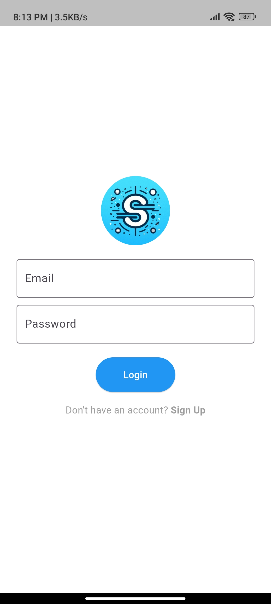
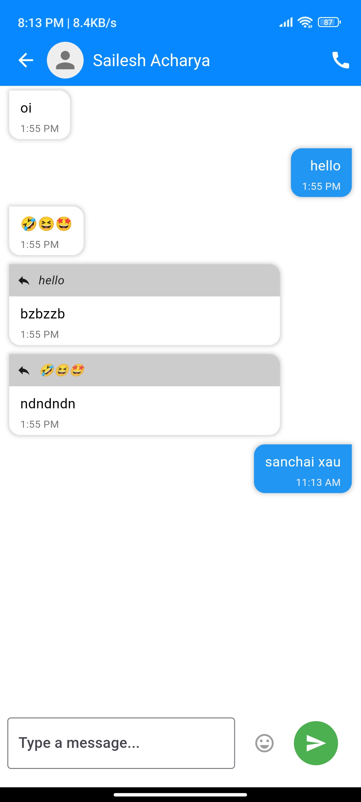

# Samparka - A chat application

A simple, lightweight chat application built with Flutter. This project demonstrates the core functionalities of a messaging app, including user authentication, real-time messaging, and a clean, minimal user interface.

---

## Table of Contents

- [Features](#features)
- [Screenshots](#screenshots)
- [Tech Stack](#tech-stack)
- [Installation](#installation)
- [Usage](#usage)
- [Contributing](#contributing)

---

## Features

- **User Authentication**: Sign up and log in securely using Firebase Authentication.
- **Real-time Messaging**: Exchange messages with other users in real-time.
- **Minimal UI**: Simple and clean interface for a smooth user experience.
- **Responsive Design**: Optimized for both iOS and Android devices.

---

## Screenshots

### Login Page


### User Page


### Chat Page


### Setting Page


### Darkmode


---

## Tech Stack

- **Frontend**: Flutter, Dart
- **Backend**: Firebase (Firebase Authentication, Firestore for real-time data)

---

## Installation

### Prerequisites
- Flutter SDK (>= 3.0.0)
- Firebase account with a configured Firebase project

### Steps

1. **Clone the Repository**

   ```bash
   https://github.com/bijuaryal91/ChatApp
   cd ChatApp

2. **Install Dependencies**
   ```bash
   flutter pub get

3. **Configure Firebase**
- Set up Firebase for both Android and iOS by following [the Firebase setup guide for Flutter](https://firebase.google.com/docs/flutter/setup).
4. **Run the App**

   ```bash
   flutter run

## Usage
1. **Sign Up / Log In**: Create an account or log in to access the chat interface.
2. **Start a Chat**: Open a chat room and send messages in real-time.
3. **Real-time Updates**: Messages appear instantly across all connected devices.

## Contributing
1. Fork the repository
2. Create a new branch (git checkout -b feature-name)
3. Commit changes (git commit -m "Add new feature")
4. Push to the branch (git push origin feature-name)
5. Open a Pull Request
